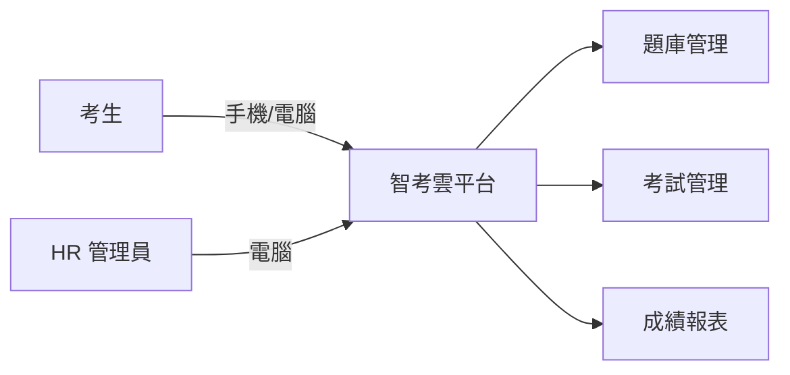
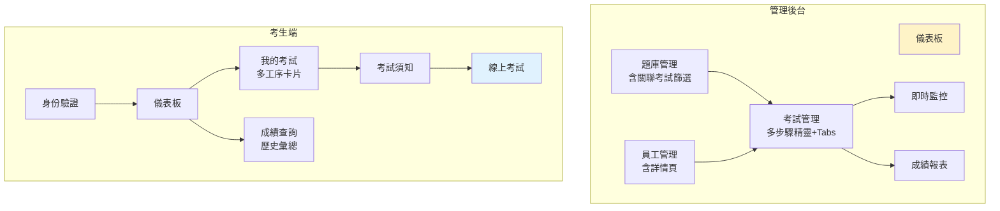
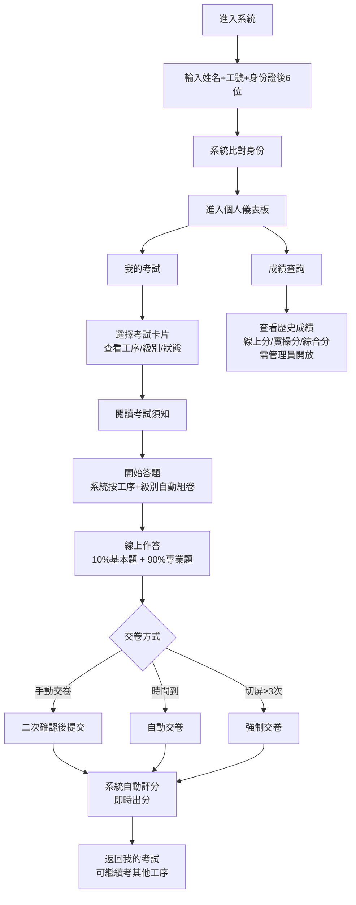
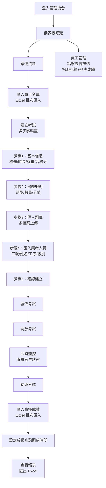
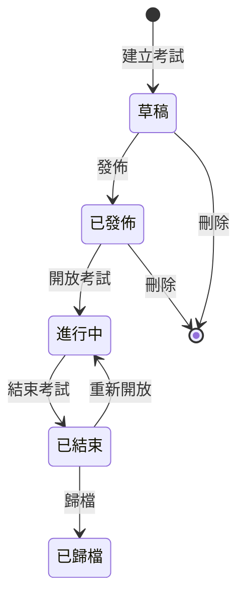
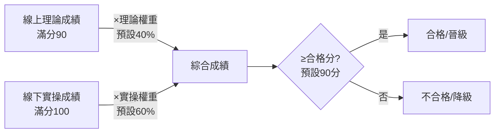

# 智考雲 — 系統設計文件（客戶版）

> **版本**：v2.0
> **建立時間**：2026/04/21
> **更新時間**：2026/04/22
> **對應產品版本**：v5.0

---

## 1. 系統簡介

智考雲是一套專為企業員工技能考核設計的線上考試平台，讓 HR 部門能夠從題庫管理、自動組卷、線上考試、即時出分到成績報表，全流程數位化管理。

**核心價值**：
- 取代紙本考試，大幅降低行政成本
- 全自動評分，交卷即出分，無需人工閱卷
- 多層防作弊機制，保障考試公平性
- 手機優先設計，考生可在任何裝置上應試

---

## 2. 系統角色

| 角色 | 說明 | 主要操作 |
|------|------|---------|
| **考生** | 一線技術崗位員工 | 身份驗證 → 儀表板 → 選擇考試（工序/級別）→ 線上考試 → 成績查詢 |
| **HR 管理員** | 人力資源部人員 | 建立考試（精靈）→ 匯入題庫/人員 → 即時監控 → 匯入實操分 → 查看報表 |

---

## 3. 功能模組總覽

---

## 4. 考生操作流程

---

## 5. 管理員操作流程

---

## 6. 各功能模組說明

### 6.1 身份驗證

- **密碼驗證**：考生輸入姓名 + 工號 + 部門 + 身份證後 6 位完成驗證
- 登入後進入個人儀表板，從「我的考試」中選擇要應考的工序
- 人臉辨識功能已隱藏（代碼保留備用）

### 6.2 題庫管理

- **題型**：單選題、多選題、判斷題（線上自動評分）
- **題目分類**：
  - **基本題**：通用基礎知識，不分工序級別，所有考生共用
  - **專業題**：依工序（如 SAW、DB、WB）及級別（Ⅰ级、Ⅱ级、Ⅲ级）分類
- **組織分類**：依部門、工序、崗位、難度級別分類管理
- **批次匯入**：支援 Excel 檔案批次匯入，自動解析欄位；支援考試綁定匯入（從檔名自動識別工序/級別）
- **手動管理**：新增、編輯、刪除個別題目
- **篩選搜尋**：依題型、部門、級別、工序、分類（基本/專業）、關聯考試快速篩選

### 6.3 考試管理

#### 建立考試（多步驟精靈）

管理員透過 5 步驟精靈建立考試：

| 步驟 | 名稱 | 內容 |
|------|------|------|
| 1 | 基本信息 | 標題、考試時長、理論/實操權重、合格分數、基本題比例 |
| 2 | 出題規則 | 各題型（單選/多選/判斷）的數量與分值設定 |
| 3 | 匯入題庫 | 上傳 Excel 檔案，系統從檔名自動識別工序/級別/分類 |
| 4 | 匯入應考人員 | 上傳名單（工號/姓名/工序/級別），系統自動匹配員工 |
| 5 | 確認建立 | 檢視摘要，確認無誤後建立考試 |

#### 考試詳情（Tabs 介面）

建立完成後，考試詳情頁以分頁方式管理：
- **基本信息**：編輯考試標題、時長、權重等參數
- **應考人員**：查看/匯入/移除應考名單（含工序、級別）
- **成績管理**：線上成績列表、匯入實操分數、匯出 Excel
- **出題規則**：檢視各題型配置

#### 考試狀態流程

#### 出題規則

- **規則式組卷**：設定各題型的數量與分值，系統自動從題庫隨機抽題
- **雙軌配比**：基本題（預設 10%）從通用題庫抽取 + 專業題（預設 90%）依考生工序+級別從專業題庫抽取
- **智慧補題**：專業題庫不足時自動以基本題庫補足
- **隨機排序**：題目與選項順序隨機，每位考生試卷不同
- **個性化組卷**：每位考生依據其報考工序與級別獲得不同的專業題組合

#### 標準考試配置

| 題型 | 數量 | 分值 | 小計 |
|------|------|------|------|
| 單選題 | 20 題 | 2 分/題 | 40 分 |
| 多選題 | 10 題 | 3 分/題 | 30 分 |
| 判斷題 | 20 題 | 1 分/題 | 20 分 |
| **合計** | **50 題** | — | **90 分** |

> 實操考核（100 分）採線下現場操作，由管理員另行安排。

#### 考試參數

| 參數 | 預設值 | 說明 |
|------|--------|------|
| 考試時限 | 60 分鐘 | 可自訂 |
| 理論權重 | 40% | 線上理論成績佔綜合成績的比例 |
| 實操權重 | 60% | 線下實操成績佔綜合成績的比例 |
| 合格分數 | 90 分 | 綜合成績達標線，可自訂 |
| 基本題比例 | 10% | 每題型中基本題的佔比，可自訂 |
| 切屏限制 | ≥ 3 次 | 強制交卷 |
| 成績查詢 | 預設關閉 | 管理員手動開放，開放期間一週 |
| 考試指派 | — | 可按部門/工序/級別指派應考人員 |

### 6.4 線上考試功能

- **倒數計時**：60 分鐘倒數，最後 5 分鐘紅色警示
- **答題導覽**：底部答題卡顯示已答/未答/標記狀態，可快速跳轉
- **自動儲存**：答案即時自動儲存，不怕斷線遺失
- **題目標記**：可標記不確定的題目，稍後回來檢查
- **交卷方式**：手動交卷（二次確認）/ 時間到自動交卷 / 切屏超限強制交卷

### 6.5 防作弊機制

| 機制 | 說明 |
|------|------|
| **動態浮水印** | 考試頁面全螢幕顯示考生姓名+工號浮水印，嚇阻截圖/錄屏 |
| **切屏偵測** | 偵測考生切換頁面/視窗，≥ 3 次強制交卷 |
| **失焦模糊** | 切換視窗時考試畫面自動模糊，截屏不可辨 |
| **禁止操作** | 禁止右鍵、複製、列印 |
| **審計日誌** | 記錄所有操作（開始考試、切屏、交卷等） |
| **即時監控** | 管理員可即時查看所有考生狀態與異常事件 |

### 6.6 自動評分

- 單選題、多選題、判斷題全部由系統自動判分
- 交卷後即時出分，無需等待人工閱卷
- 依題型分類統計各項得分明細

### 6.7 綜合成績計算

- **計算公式**：綜合成績 = 線上理論 × 理論權重 + 線下實操 × 實操權重
- **權重可調**：理論權重與實操權重由管理員在建立考試時設定（預設 40% / 60%）
- **合格分可調**：預設 90 分，可依考試需求調整
- 線下實操成績由管理員透過 Excel 批次匯入，系統自動計算綜合成績

### 6.8 成績與報表

- **成績列表**：查看所有考生的成績、用時、狀態
- **成績詳情**：查看單一考生的每題作答與評分明細
- **統計報表**：通過率、平均分、分數分佈、排名分析、缺考統計
- **Excel 匯出**：將成績資料匯出為 Excel，便於公示與津貼核算
- **成績查詢控制**：考生端預設關閉，管理員手動開放，開放期間一週

### 6.9 員工管理

- **員工列表**：點擊任一列即可進入員工詳情頁
- **員工詳情頁**：
  - 基本信息：姓名、工號、部門、崗位、狀態、入職日期
  - 考試指派記錄：該員工被指派的所有考試及工序/級別
  - 歷史成績：線上分、實操分、綜合分、合格與否
- **批次匯入**：Excel 匯入員工名單（預覽確認後才寫入）
- **手動管理**：新增個別員工
- **篩選**：依部門篩選員工列表
- 照片上傳與人臉辨識功能已隱藏（代碼保留備用）

### 6.10 儀表板

- 考試總數、題庫數量、員工數量快速概覽
- 系統整體使用狀態一目瞭然

### 6.11 考核證書

- 考試通過後自動產生考核證書
- 顯示考生姓名、部門、崗位、成績、等級
- 支援列印/下載

---

## 7. 操作介面說明

### 管理後台

| 頁面 | 功能說明 |
|------|---------|
| 儀表板 | 系統概況總覽（考試/題庫/員工數量） |
| 題庫管理 | 題目列表、新增、編輯、刪除、Excel 匯入、依工序/分類/考試篩選 |
| 考試管理 | 考試列表、多步驟精靈建立考試、Tabs 詳情頁（基本信息/人員/成績/規則）、發佈、監控、刪除 |
| 員工管理 | 員工列表（整列可點擊）、員工詳情頁（指派記錄+歷史成績）、新增、Excel 匯入 |
| 報表中心 | 統計分析、Excel 匯出 |

### 考生端

| 頁面 | 功能說明 |
|------|---------|
| 登入頁 | 輸入姓名+工號+部門+身份證後6位驗證 |
| 儀表板 | 歡迎訊息、系統介紹、快捷入口 |
| 我的考試 | 多工序考試卡片列表（顯示工序/級別/狀態），點擊進入考試 |
| 考試須知 | 查看考試規則與注意事項 |
| 考試頁面 | 線上作答（倒數計時、答題導覽、自動儲存）|
| 成績查詢 | 歷史成績彙總（線上分/實操分/綜合分），需管理員開放 |
| 證書頁面 | 查看與下載考核證書 |

---

## 8. 裝置支援

| 裝置 | 角色 | 說明 |
|------|------|------|
| 手機（iOS/Android） | 考生 | **主要使用場景**，豎屏最佳化設計 |
| 平板 | 考生/管理員 | 完整支援 |
| 桌面電腦 | 管理員 | 管理後台建議使用桌面操作 |

---

## 9. 版本功能調整紀錄

### v1.0 調整

| 項目 | 調整內容 | 原因 |
|------|---------|------|
| 線上考試題型 | 僅支援單選/多選/判斷 | 簡答題採線下紙質方式，不在系統內作答 |
| 閱卷功能 | 暫時隱藏 | 客觀題全自動評分，無需人工閱卷（如未來需要可恢復） |
| 考試刪除 | 新增刪除功能 | 草稿或已發佈但未開放的考試可刪除 |
| 員工匯入 | 增加預覽確認 | 匯入前先預覽資料，確認無誤後才正式寫入 |

### v2.0 調整

| 項目 | 調整內容 | 原因 |
|------|---------|------|
| 多工序考試 | 一場考試支援多個工序，每位考生依工序+級別獲得不同試卷 | 對應實際業務需求，一次考試涵蓋多個工序考核 |
| 建立考試精靈 | 改為 5 步驟精靈（基本信息→出題規則→匯入題庫→匯入人員→確認） | 提升建立考試的引導性與操作體驗 |
| 考試詳情 Tabs | 詳情頁改為分頁介面（基本信息/應考人員/成績管理/出題規則） | 資訊量增加，分頁管理更清晰 |
| 題庫雙軌分類 | 題目分為「基本題」與「專業題」，專業題依工序+級別歸類 | 實現 10% 基本題 + 90% 專業題的組卷配比 |
| 權重可調 | 理論/實操權重、合格分數、基本題比例均可自訂 | 不同考試可能有不同的評分標準 |
| 考生端改版 | 登入後進入儀表板，新增「我的考試」和「成績查詢」頁面 | 支援多工序考試選擇與歷史成績查詢 |
| 員工詳情頁 | 新增員工詳情頁（指派記錄+歷史成績） | 方便管理員查看個別員工的考試歷程 |
| 人臉辨識 | 功能隱藏（代碼保留） | 現階段以密碼驗證為主，降低部署複雜度 |
| 簡答題 | 從綜合成績計算中移除 | 簡答題改為線下紙質，不再納入系統計算 |

---

**文件狀態**：v2.0 — 多工序考試架構改版
