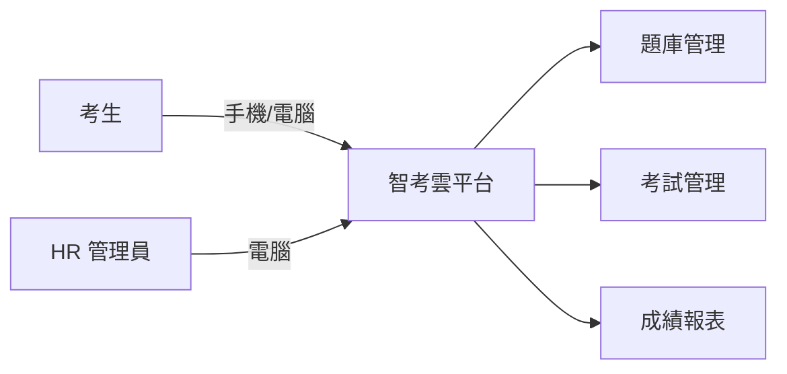
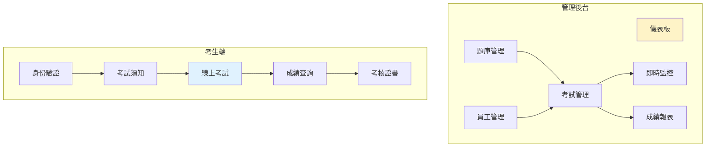
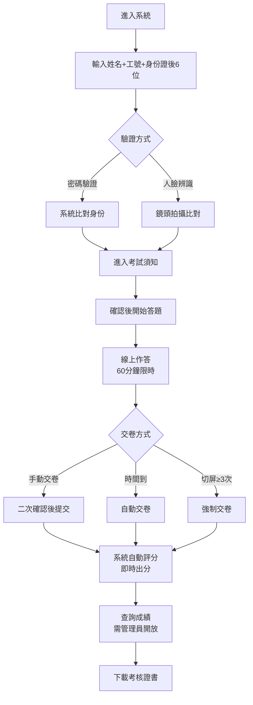
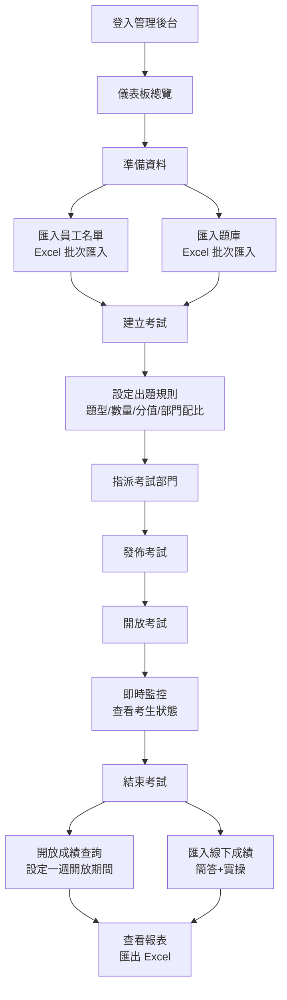
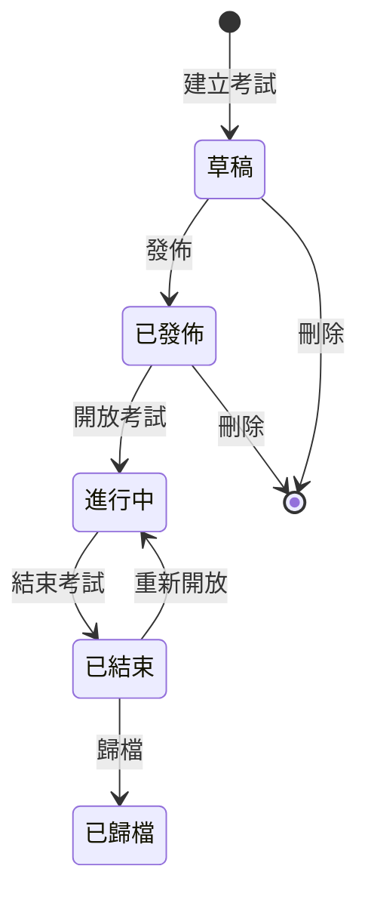
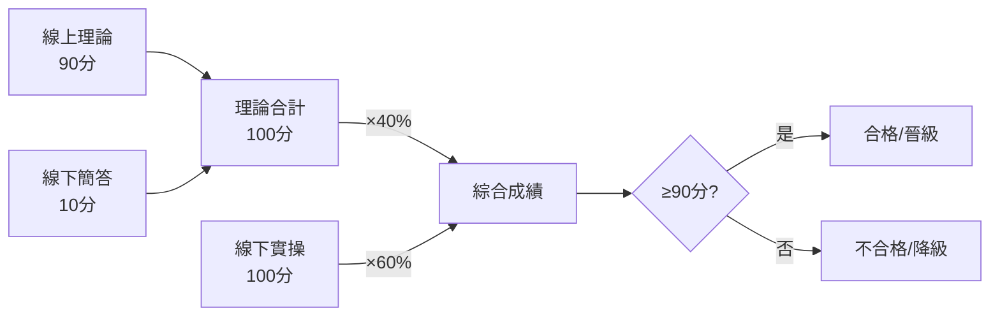

# 智考雲 — 系統設計文件（客戶版）

> **版本**：v1.0
> **建立時間**：2026/04/21
> **對應產品版本**：v4.0

---

## 1. 系統簡介

智考雲是一套專為企業員工技能考核設計的線上考試平台，讓 HR 部門能夠從題庫管理、自動組卷、線上考試、即時出分到成績報表，全流程數位化管理。

**核心價值**：
- 取代紙本考試，大幅降低行政成本
- 全自動評分，交卷即出分，無需人工閱卷
- 多層防作弊機制，保障考試公平性
- 手機優先設計，考生可在任何裝置上應試

---

## 2. 系統角色

| 角色 | 說明 | 主要操作 |
|------|------|---------|
| **考生** | 一線技術崗位員工 | 身份驗證 → 線上考試 → 查詢成績 → 下載證書 |
| **HR 管理員** | 人力資源部人員 | 管理題庫/員工 → 建立考試 → 即時監控 → 查看報表 |

---

## 3. 功能模組總覽

---

## 4. 考生操作流程

---

## 5. 管理員操作流程

---

## 6. 各功能模組說明

### 6.1 身份驗證

- **密碼驗證**：考生輸入姓名 + 工號 + 部門 + 身份證後 6 位完成驗證
- **人臉辨識**：鏡頭拍攝人臉，與 HR 預先建立的照片進行比對
- **自動匹配**：系統根據考生部門/崗位自動匹配對應考試，無需手動選擇

### 6.2 題庫管理

- **題型**：單選題、多選題、判斷題（線上自動評分）
- **分類**：依部門、工序、崗位、難度級別分類管理
- **批次匯入**：支援 Excel 檔案批次匯入，自動解析欄位
- **手動管理**：新增、編輯、刪除個別題目
- **篩選搜尋**：依題型、部門、級別、關鍵字快速篩選

### 6.3 考試管理

#### 考試狀態流程

#### 出題規則

- **規則式組卷**：設定各題型的數量與分值，系統自動從題庫隨機抽題
- **部門配比**：通用基礎模組 10% + 崗位專業模組 90%
- **智慧補題**：題庫不足時自動以通用題庫補足
- **隨機排序**：題目與選項順序隨機，每位考生試卷不同

#### 標準考試配置

| 題型 | 數量 | 分值 | 小計 |
|------|------|------|------|
| 單選題 | 20 題 | 2 分/題 | 40 分 |
| 多選題 | 10 題 | 3 分/題 | 30 分 |
| 判斷題 | 20 題 | 1 分/題 | 20 分 |
| **合計** | **50 題** | — | **90 分** |

> 簡答題（10 分）採線下紙質方式，實操考核（100 分）採線下現場操作。

#### 考試參數

| 參數 | 說明 |
|------|------|
| 考試時限 | 60 分鐘 |
| 及格分數 | 90 分（綜合成績） |
| 切屏限制 | ≥ 3 次強制交卷 |
| 成績查詢 | 管理員手動開放，開放期間一週 |
| 考試指派 | 可按部門/崗位指派可應試人員 |

### 6.4 線上考試功能

- **倒數計時**：60 分鐘倒數，最後 5 分鐘紅色警示
- **答題導覽**：底部答題卡顯示已答/未答/標記狀態，可快速跳轉
- **自動儲存**：答案即時自動儲存，不怕斷線遺失
- **題目標記**：可標記不確定的題目，稍後回來檢查
- **交卷方式**：手動交卷（二次確認）/ 時間到自動交卷 / 切屏超限強制交卷

### 6.5 防作弊機制

| 機制 | 說明 |
|------|------|
| **動態浮水印** | 考試頁面全螢幕顯示考生姓名+工號浮水印，嚇阻截圖/錄屏 |
| **切屏偵測** | 偵測考生切換頁面/視窗，≥ 3 次強制交卷 |
| **失焦模糊** | 切換視窗時考試畫面自動模糊，截屏不可辨 |
| **禁止操作** | 禁止右鍵、複製、列印 |
| **審計日誌** | 記錄所有操作（開始考試、切屏、交卷等） |
| **即時監控** | 管理員可即時查看所有考生狀態與異常事件 |

### 6.6 自動評分

- 單選題、多選題、判斷題全部由系統自動判分
- 交卷後即時出分，無需等待人工閱卷
- 依題型分類統計各項得分明細

### 6.7 綜合成績計算

- 線下簡答成績與實操成績由管理員透過 Excel 批次匯入
- 系統自動計算綜合成績

### 6.8 成績與報表

- **成績列表**：查看所有考生的成績、用時、狀態
- **成績詳情**：查看單一考生的每題作答與評分明細
- **統計報表**：通過率、平均分、分數分佈、排名分析、缺考統計
- **Excel 匯出**：將成績資料匯出為 Excel，便於公示與津貼核算
- **成績查詢控制**：考生端預設關閉，管理員手動開放，開放期間一週

### 6.9 員工管理

- **批次匯入**：Excel 匯入員工名單（預覽確認後才寫入）
- **手動管理**：新增個別員工
- **照片上傳**：上傳員工照片，用於人臉辨識
- **篩選**：依部門篩選員工列表

### 6.10 儀表板

- 考試總數、題庫數量、員工數量快速概覽
- 系統整體使用狀態一目瞭然

### 6.11 考核證書

- 考試通過後自動產生考核證書
- 顯示考生姓名、部門、崗位、成績、等級
- 支援列印/下載

---

## 7. 操作介面說明

### 管理後台

| 頁面 | 功能說明 |
|------|---------|
| 儀表板 | 系統概況總覽 |
| 題庫管理 | 題目列表、新增、編輯、刪除、Excel 匯入 |
| 考試管理 | 考試列表、建立考試、編輯、發佈、監控、成績、刪除 |
| 員工管理 | 員工列表、新增、Excel 匯入、照片上傳 |
| 報表中心 | 統計分析、Excel 匯出 |

### 考生端

| 頁面 | 功能說明 |
|------|---------|
| 登入頁 | 輸入身份資訊驗證 |
| 考試須知 | 查看考試規則與注意事項 |
| 考試頁面 | 線上作答（倒數計時、答題導覽、自動儲存）|
| 成績頁面 | 查看成績與各題型得分明細 |
| 證書頁面 | 查看與下載考核證書 |

---

## 8. 裝置支援

| 裝置 | 角色 | 說明 |
|------|------|------|
| 手機（iOS/Android） | 考生 | **主要使用場景**，豎屏最佳化設計 |
| 平板 | 考生/管理員 | 完整支援 |
| 桌面電腦 | 管理員 | 管理後台建議使用桌面操作 |

---

## 9. 本次功能調整

| 項目 | 調整內容 | 原因 |
|------|---------|------|
| 線上考試題型 | 僅支援單選/多選/判斷 | 簡答題採線下紙質方式，不在系統內作答 |
| 閱卷功能 | 暫時隱藏 | 客觀題全自動評分，無需人工閱卷（如未來需要可恢復） |
| 考試刪除 | 新增刪除功能 | 草稿或已發佈但未開放的考試可刪除 |
| 員工匯入 | 增加預覽確認 | 匯入前先預覽資料，確認無誤後才正式寫入 |

---

**文件狀態**：v1.0 — 初版建立
