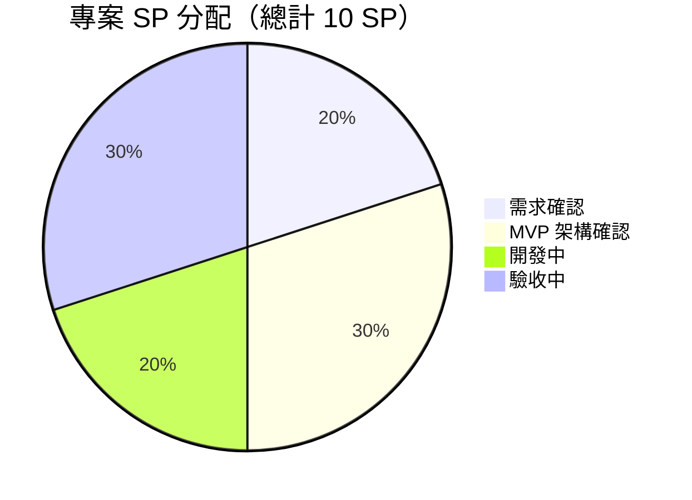

# 智考雲 — 企業員工線上考核平台 ( Story Points )

**文件版本：** 1.0
**製作日期：** 2026-04-20
**專案名稱：** 智考雲 — 員工技能考核系統 MVP

---

## 📋 專案概述

本專案為一套企業員工線上技能考核平台，旨在替代傳統紙本考試與 Excel 統計流程，提供全自動出題、線上應試、即時評分與成績報表功能，支撐半年一次的全面技能考核。

### 核心價值
- 自動化考核：規則式出題、全自動評分、即時出分，無需人工閱卷
- 行動優先：手機豎屏為主設計，員工可隨時隨地應試
- 防作弊保障：動態浮水印、切屏偵測、失焦模糊、可選原生 App 殼（FLAG_SECURE）
- 數據驅動：通過率、分數分佈、排名分析、異常記錄一覽無遺

### 技術架構
- **前端：** Next.js 16 + React 19 + TypeScript + Tailwind CSS 4
- **後端：** Prisma + MySQL
- **身份驗證：** JWT（jose）+ bcrypt + face-api.js
- **即時推送：** Server-Sent Events（SSE）
- **原生 App 殼：** React Native + WebView + FLAG_SECURE（可選）

---

## 📊 專案規模總覽

### 整體 Story Points 分配

### 專案指標

| 專案指標 | SP |
|---|---:|
| 需求確認 | 2 |
| MVP 架構確認 | 3 |
| 開發中 | 2 |
| 驗收中 | 3 |
| **合計** | **10 SP** |

### SP 階段說明

| 階段 | SP | 範圍 | 說明 |
|------|---:|------|------|
| 需求確認 | 2 | PRD 文件、客戶需求對齊 | 依據客戶提供之考核方案 PPT，確認題型配置、評分規則、防作弊需求、成績開放機制等 |
| MVP 架構確認 | 3 | 技術選型、資料模型、系統架構 | 確認前後端架構、資料庫設計、API 規劃、身份驗證方案、防作弊技術可行性分析 |
| 開發中 | 2 | 核心功能開發與整合 | 題庫管理、考試引擎、自動評分、防作弊、員工管理、即時監控、報表等功能的開發與整合 |
| 驗收中 | 3 | 功能驗收、效能測試、上線準備 | 全功能驗收測試、跨裝置相容性測試、壓力測試、客戶 UAT、部署上線 |

---

## 🗂️ 功能模組清單

### 模組 1：身份驗證系統

| 功能 | 狀態 | 說明 |
|------|------|------|
| 密碼驗證 | ✅ 完成 | 姓名 + 工號 + 部門 + 身份證後 6 位 |
| JWT Token 簽發 | ✅ 完成 | 考生 3 小時、管理員 8 小時有效 |
| 人臉辨識 | ✅ 完成 | face-api.js 特徵向量比對 |
| 管理員登入 | ✅ 完成 | 帳號密碼 + bcrypt 雜湊 |
| 自動匹配試卷 | ✅ 完成 | 根據姓名匹配部門/工序試卷 |

---

### 模組 2：題庫管理

| 功能 | 狀態 | 說明 |
|------|------|------|
| 單選題管理 | ✅ 完成 | SINGLE_CHOICE CRUD |
| 多選題管理 | ✅ 完成 | MULTI_CHOICE CRUD |
| 判斷題管理 | ✅ 完成 | TRUE_FALSE CRUD |
| Excel 批次匯入 | ✅ 完成 | 支援 .xls / .xlsx 格式 |
| 篩選與搜尋 | ✅ 完成 | 依題型、部門、級別、關鍵字 |
| 部門/工序分類 | ✅ 完成 | 通用基礎模組 + 崗位專業模組 |
| 難度級別 | ✅ 完成 | 一級/二級/三級題庫 |

> 注意：簡答題不納入線上系統，採線下紙質方式進行。

---

### 模組 3：考試管理

| 功能 | 狀態 | 說明 |
|------|------|------|
| 建立/編輯考試 | ✅ 完成 | 標題、時限、及格分、開放時段 |
| 規則式出題 | ✅ 完成 | 單選 20×2 + 多選 10×3 + 判斷 20×1 = 90 分 |
| 部門配比 | ✅ 完成 | 通用 10% + 崗位 90% |
| 智慧補題 | ✅ 完成 | 題庫不足時自動補足 |
| 隨機抽題/防重複 | ✅ 完成 | 隨機排序題目與選項 |
| 考試狀態管理 | ✅ 完成 | DRAFT → PUBLISHED → ACTIVE → CLOSED → ARCHIVED |
| 開放時段控制 | ✅ 完成 | 指定考試開放時間區間 |

---

### 模組 4：線上考試引擎

| 功能 | 狀態 | 說明 |
|------|------|------|
| 倒數計時器 | ✅ 完成 | 60 分鐘，最後 5 分鐘紅色警示 |
| 答案自動儲存 | ✅ 完成 | 三層儲存：本地 → 防抖同步 → 離線佇列 |
| 題目標記 | ✅ 完成 | 一鍵標記不確定題目 |
| 答題導覽 | ✅ 完成 | 懸浮/底部導覽，已答/未答/標記狀態 |
| 手動交卷 | ✅ 完成 | 二次確認提示 |
| 自動交卷 | ✅ 完成 | 超時/切屏超限/考試結束 |
| 斷線恢復 | ✅ 完成 | 重連後繼續作答，進度完整保留 |
| Zustand 狀態管理 | ✅ 完成 | localStorage 持久化 |

---

### 模組 5：防作弊監控

| 功能 | 狀態 | 說明 |
|------|------|------|
| 切屏偵測 | ✅ 完成 | ≥3 次強制交卷 |
| 動態浮水印 | ✅ 完成 | 姓名 + 工號半透明覆蓋 |
| 失焦模糊 | ✅ 完成 | Alt+Tab 時 blur(10px) |
| 禁止操作 | ✅ 完成 | 禁右鍵、複製、選取、列印 |
| PrintScreen 攔截 | ✅ 完成 | 嘗試清除剪貼簿（薄弱防線） |
| 網路狀態監測 | ✅ 完成 | 偵測斷線/重連事件 |
| 審計日誌 | ✅ 完成 | 記錄所有敏感操作 |
| SSE 即時監控 | ✅ 完成 | 管理員即時查看考生狀態 |
| Android FLAG_SECURE | ✅ 完成 | 原生 App 殼，截屏/錄屏全黑 |
| iOS 截屏偵測 | ✅ 完成 | 截屏警告 + 錄屏遮罩 |

---

### 模組 6：全自動評分

| 功能 | 狀態 | 說明 |
|------|------|------|
| 自動判分 | ✅ 完成 | 單選/多選/判斷全自動，無需人工 |
| 分類統計 | ✅ 完成 | 依題型計算各類得分明細 |
| 等級評定 | ✅ 完成 | A/B/C/D/F 五級 |
| 即時出分 | ✅ 完成 | 交卷後立即計算成績 |

> 注意：不包含簡答題閱卷，不需要主管評分。

---

### 模組 7：員工管理

| 功能 | 狀態 | 說明 |
|------|------|------|
| Excel 批次匯入 | ✅ 完成 | 工號、姓名、部門、崗位、身份證後 6 位 |
| 手動 CRUD | ✅ 完成 | 新增、編輯、刪除員工 |
| 照片上傳 | ✅ 完成 | 人臉辨識基準建立 |
| 人臉資料錄入 | ✅ 完成 | 儲存人臉特徵向量 |
| 部門篩選 | ✅ 完成 | 依部門篩選員工列表 |

---

### 模組 8：成績與報表

| 功能 | 狀態 | 說明 |
|------|------|------|
| 成績列表 | ✅ 完成 | 管理員端隨時可查 |
| 成績詳情 | ✅ 完成 | 每題作答與評分明細 |
| 統計報表 | ✅ 完成 | 通過率、平均分、分數分佈、排名 |
| 異常記錄 | ✅ 完成 | 缺考、作弊、切屏異常彙整 |
| Excel 匯出 | ✅ 完成 | 成績匯出為 Excel |
| 考生查詢控制 | ✅ 完成 | 管理員手動開放，開放期間一週 |
| 錯題追蹤 | ✅ 完成 | 管理員開放後考生可查詢 |

> 注意：成績報表與錯題追蹤需管理員手動點擊「開放查詢」後考生方可查詢，開放期間為一週，期滿自動關閉。

---

### 模組 9：儀表板與證書

| 功能 | 狀態 | 說明 |
|------|------|------|
| 系統概況 | ✅ 完成 | 考試總數、題庫數量、員工數量 |
| 考核證書 | ✅ 完成 | 自動產生，支援列印/下載 PDF |

---

### 模組 10：響應式設計

| 功能 | 狀態 | 說明 |
|------|------|------|
| 手機豎屏佈局 | ✅ 完成 | 考生端手機優先設計 |
| 答題卡懸浮/底部導覽 | ✅ 完成 | 已答/未答/標記狀態 |
| 管理後台雙版面 | ✅ 完成 | 桌面表格 + 手機卡片 |
| Bottom-sheet 彈窗 | ✅ 完成 | 手機端彈窗適配 |

---

## 📦 交付物清單

### 系統交付物

✅ **考生端 Web 應用**
- 身份驗證（密碼 + 人臉辨識）
- 考試須知頁面（可折疊/滑動）
- 線上考試引擎（計時、自動儲存、導覽、標記）
- 防作弊系統（浮水印、切屏偵測、失焦模糊）
- 成績查詢（管理員開放後可用，一週期限）
- 考核證書下載

✅ **管理後台 Web 應用**
- 儀表板概覽
- 題庫管理（CRUD + Excel 批次匯入）
- 考試管理（規則式出題、參數設定、狀態管理）
- 員工管理（CRUD + Excel 批次匯入 + 照片上傳）
- 即時監控（SSE 推送、考生狀態、異常警示）
- 成績報表（統計分析 + Excel 匯出 + 查詢開放控制）

✅ **原生 App 殼（可選）**
- Android：React Native + WebView + FLAG_SECURE（截屏全黑）
- iOS：截屏偵測警告 + 錄屏遮罩

✅ **後端 API 服務**
- RESTful API（完整 CRUD）
- JWT 身份驗證
- MySQL 資料庫（Prisma ORM）
- SSE 即時推送
- 審計日誌

---

### 文件交付物

✅ **PRD 產品需求文件** — 完整的產品需求規格（v3.0）
✅ **SP 規格書** — 本文件，Story Points 分配與功能模組清單
✅ **README** — 專案技術文件與部署指南

---

## ✅ 驗收標準

### 功能驗收檢查表

#### 1. 身份驗證
- [ ] 密碼驗證（姓名 + 身份證後 6 位）登入成功
- [ ] 人臉辨識登入成功
- [ ] 系統自動匹配試卷類型正確
- [ ] JWT Token 正常簽發與過期處理
- [ ] 管理員登入正常

#### 2. 題庫管理
- [ ] 單選題 CRUD 正常
- [ ] 多選題 CRUD 正常
- [ ] 判斷題 CRUD 正常
- [ ] Excel 批次匯入成功（.xls / .xlsx）
- [ ] 篩選與搜尋功能正常
- [ ] 部門/工序/難度級別分類正確

#### 3. 考試管理
- [ ] 建立考試並設定出題規則成功
- [ ] 規則式出題正確（單選 20 + 多選 10 + 判斷 20）
- [ ] 部門配比（通用 10% + 崗位 90%）抽題正確
- [ ] 智慧補題在題庫不足時自動補足
- [ ] 隨機抽題、防重複正常
- [ ] 考試狀態流轉正確

#### 4. 線上考試引擎
- [ ] 倒數計時器正確運作，最後 5 分鐘紅色警示
- [ ] 答案自動儲存正常（切題、選答案觸發）
- [ ] 離線佇列在斷線時暫存，重連後同步
- [ ] 題目標記功能正常
- [ ] 答題導覽列狀態（已答/未答/標記）正確
- [ ] 手動交卷二次確認正常
- [ ] 超時自動交卷正常
- [ ] 切屏超限自動交卷正常

#### 5. 防作弊監控
- [ ] 切屏偵測記錄正確，≥3 次強制交卷
- [ ] 動態浮水印顯示考生姓名 + 工號
- [ ] 失焦模糊在視窗切換時生效
- [ ] 禁止右鍵/複製/選取/列印正常
- [ ] 審計日誌記錄完整
- [ ] SSE 即時監控推送正常
- [ ] 管理員監控頁面顯示考生狀態與異常

#### 6. 全自動評分
- [ ] 單選題自動判分正確
- [ ] 多選題自動判分正確
- [ ] 判斷題自動判分正確
- [ ] 交卷後即時出分
- [ ] 分類統計（各題型得分明細）正確
- [ ] 等級評定正確

#### 7. 成績與報表
- [ ] 管理員端成績列表隨時可查
- [ ] 考生端成績預設為關閉狀態
- [ ] 管理員點擊「開放查詢」後考生可查詢
- [ ] 開放期間一週後自動關閉
- [ ] 錯題追蹤在開放期間可查詢
- [ ] 統計報表數據正確（通過率、平均分、分數分佈）
- [ ] Excel 匯出成功

#### 8. 員工管理
- [ ] Excel 批次匯入員工名單成功
- [ ] 員工 CRUD 正常
- [ ] 照片上傳正常
- [ ] 人臉特徵向量儲存正確
- [ ] 部門篩選正常

#### 9. 系統穩定性
- [ ] 考試頁面載入時間 < 2 秒
- [ ] 200 位考生同時應試系統穩定
- [ ] SSE 推送延遲 < 3 秒
- [ ] 無重大 Bug
- [ ] 安全性檢查通過（XSS、注入防護）

#### 10. 跨裝置相容性
- [ ] 手機端（iPhone / Android）考試流程順暢
- [ ] 桌面瀏覽器（Chrome / Edge）管理後台正常
- [ ] 平板裝置顯示正常
- [ ] 手機豎屏佈局正確

---

## 🚫 明確排除項目

| 排除項目 | 原因 |
|----------|------|
| 補考機制 | 補考不適用於技能考試 |
| 簡答題線上作答 | 簡答題採線下紙質方式 |
| 人工閱卷 | 全部客觀題，系統全自動評分 |
| 影片監考 | MVP 範圍外 |
| 線上即時答疑 | MVP 範圍外 |
| 技能津貼核算 | 僅提供成績數據支撐 |

---

## 🎯 專案成功標準

### 核心指標

✅ **功能完整性：** 所有列出的功能模組正常運作
✅ **自動化程度：** 線上考試題目 100% 全自動評分，無需人工閱卷
✅ **效能標準：** 考試頁面載入 < 2 秒，支援 200 人同時應試
✅ **穩定性：** 考試進行中系統可用性達 99.9%
✅ **使用者體驗：** 手機端應試順暢，滿意度 ≥ 4.0/5.0
✅ **資料完整性：** 答案儲存成功率 ≥ 99.99%
✅ **考核覆蓋率：** 覆蓋所有目標部門（生產/工務/制程品管/工程研發/資材/客戶質量）

---
